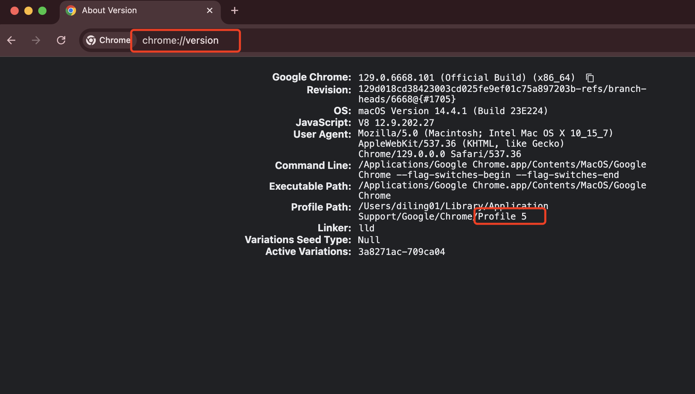

# chrome-auto

> 背景：使用 Chrome 浏览器的不同 Profile 登陆不同的账号（这里的账号不限于 Google 账号），需要对多个账号进行批量操作，例如：批量检测多个 GCP 账号的剩余免费配额

Chrome 浏览器多账号批量自动化执行脚本

## Chrome Profile 说明

一个 Google 账号对应一个 Chrome Profile

Profile 名称可以通过 `chrome://version` 进行获取



## 关键方法

[core.py](./core.py) 文件中 `run` 方法

```python
def run(profile, fn):
    """
    profile: 指定 profile 名称
    fn: 执行函数，函数参数为 Chrome WebDriver 对象
    """

    ...
```

## 简单示例

批量打印指定 Google 账号的邮箱

```python
import logging

from selenium.webdriver.common.by import By
from selenium.webdriver.support.wait import WebDriverWait
from selenium.webdriver.support import expected_conditions as EC

from chrome_auto import run


def get_profile_email(driver):
    driver.get("https://myaccount.google.com/email")

    el = WebDriverWait(driver, 100).until(
        EC.presence_of_element_located((By.XPATH, '/html/body/c-wiz/div/div[2]/div[2]/c-wiz/div/div[4]/article/ul/li/div/div/div'))
    )
    return el.text


def main():
    profiles = ["Default"]

    for profile in profiles:
        def print_profile_email(driver):
            email = get_profile_email(driver)
            logging.info(f"Profile - {profile}, email: {email}")

        run(profile, print_profile_email)
        

if __name__ == "__main__":
    main()

```

## 运行

```bash
python3.10 -m virtualenv .venv
source .venv/bin/activate
pip install -r requirements.txt
python3.10 profile_email.py
```

## 下载 ChromeDriver

- https://sites.google.com/chromium.org/driver/downloads
- https://googlechromelabs.github.io/chrome-for-testing/
